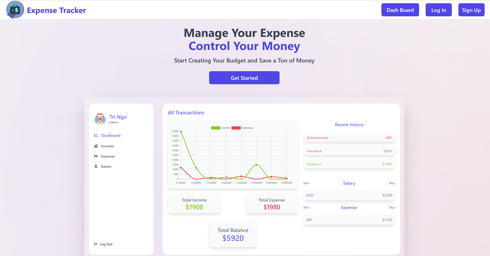
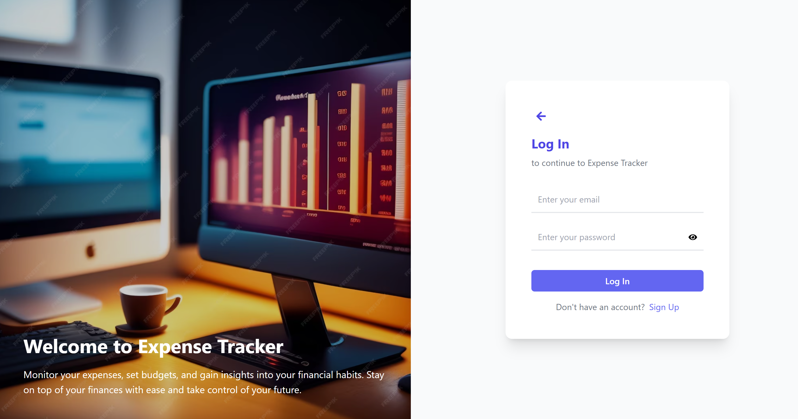
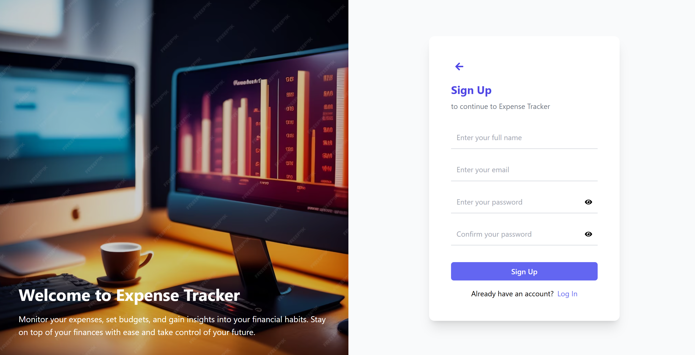

# Expense Tracker App

A full-stack expense tracker app built using React, Node, Express, MongoDB, and styled with Tailwind CSS. This app helps users track their income and expenses securely, offering administrative control for managing users' data.

## Features

- **Secured Authentication with JWT**: 
  - Secure user authentication via JSON Web Tokens (JWT) for both login and signup.
  
- **Income & Expense Management**:
  - Create, update, and delete income and expense entries.
  
- **Admin Control Panel**:
  - Admin users have access to a special control panel where they can manage users and review their financial data.

## Technologies Used

- **Frontend**:
  - React.js (for building the user interface)
  - Tailwind CSS (for styling the app)

- **Backend**:
  - Node.js & Express (for handling API requests and server logic)
  - MongoDB (for database storage)

- **Authentication**:
  - JWT (JSON Web Tokens) for secure authentication

## Setup Instructions

### 1. Clone the Repository

```bash
git clone https://github.com/tringo286/Expense-Tracker.git
cd Expense-Tracker
```

### 2. Clone the Repository

Install dependencies
Navigate to the backend folder and install dependencies:

```bash
cd backend
npm install
```

Environment variables
Create a .env file in the backend directory with the following variables:

```bash
MONGO_URI=<your_mongo_connection_string>
PORT=5000
```

Start the backend server

```bash
npm run server
```

### 3. Frontend Setup (React)

Install dependencies
Navigate to the frontend folder and install dependencies:

```bash
cd frontend
npm install
```

Start the backend server

```bash
npm run dev
```

### 4. Database Setup (MongoDB)
Ensure you have MongoDB set up. Obtain the MongoDB connection string and add it to the .env file as MONGO_URI.

### 5. Demo






### 6. Deployed Website
You can access the live version of this application at: [Expense Tracker](https://spendings-tracker-app.netlify.app)